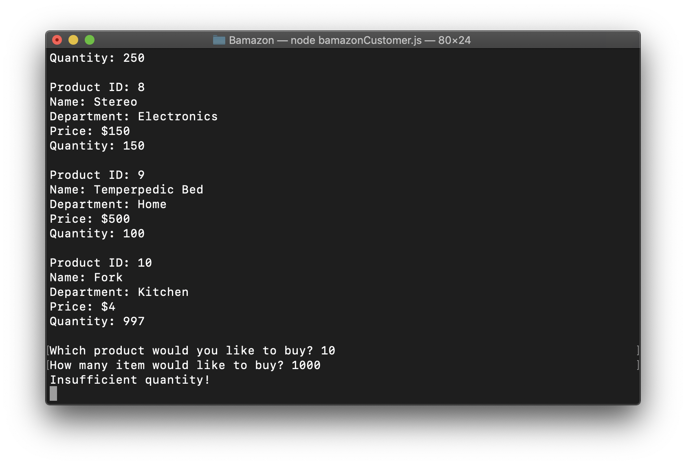
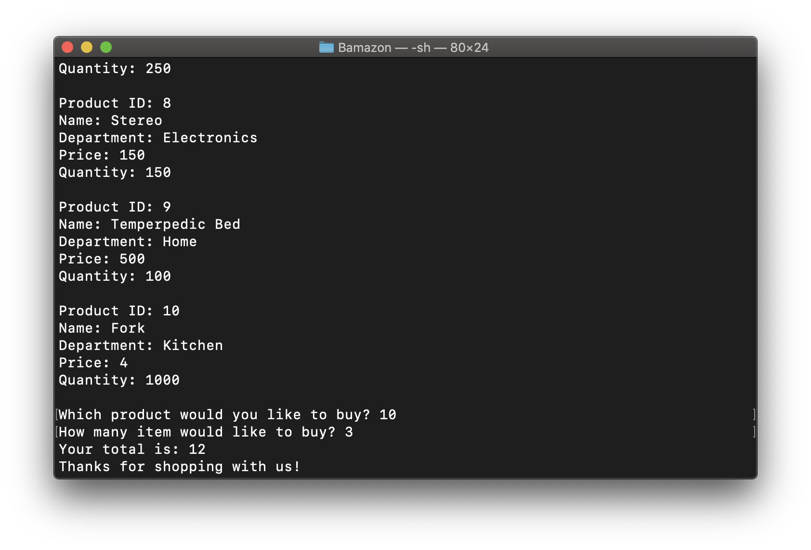

# Bamazon
Amazon-like storefront using MySQL &amp; Node.js

# Usage
1. Run ```node bamazonCustomer.js```. The program will display all the products available. Example:
``` 
Product ID: 1
Name: Baseball
Department: Sports
Price: 15
Quantity: 100

Product ID: 2
Name: Basketball
Department: Sports
Price: 25
Quantity: 85
```
3. The program will prompt "Which product would you like to buy?". Provide the Product ID. Then, the program will ask "How many items would like to buy?". Provide the quantity. Example: 
```
Which product would you like to buy? 1 
How many items would like to buy? 3
```
- If there are enough products in stock, the program will return the total price of the sell. 
```
Your total is: $45
Thanks for shopping with us!
```
- Otherwise, the program will prompt "Insufficient quantity!"

# Screenshots


